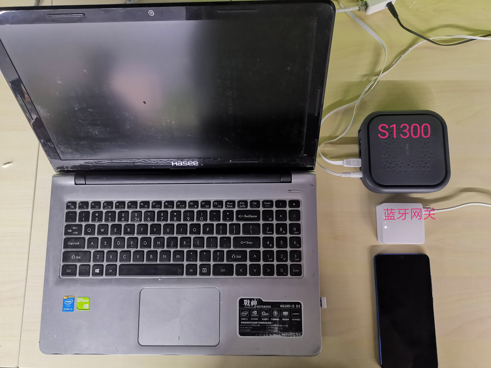

# 
基于MT300N-V2的蓝牙网关
**1. 使用场景**
这个demo是针对民宿酒店蓝牙锁项目的解决方案。主要应用场景是MT300N-V2作为蓝牙网关，将蓝牙锁传来的信息透传到云端服务器上去，同时支持通过蓝牙本地配置wifi中继，MQTT服务器信息等。
**2. 主要功能**
  - 蓝牙
  蓝牙网关作为GATT server，可供蓝牙锁连接，读写指定UUID下的数据。同时以Notify的形式将消息主动通知给蓝牙锁。
  - wifi中继
  支持通过蓝牙来配置wifi中继功能，实现上网。
  - MQTT
  支持通过蓝牙配置云端MQTT服务器相关信息，并能够与云端服务器双向通讯。(这里我使用的是我们自己GL-inet的云端服务器，没有MQTT地址用户名等信息配置的步骤了)  

**3. Demo展示**
  - Demo环境搭建
  如图所示，S1300当做单纯的路由器用来连接外网；蓝牙网关通过wifi中继S1300来上网；手机配合手机端的蓝牙调试工具模拟蓝牙锁，连接蓝牙网关并读写，接收蓝牙消息；笔记本用来投屏录屏，观察demo现象。
  
   
  - 通过蓝牙配置wifi中继功能
  手机通过蓝牙连接蓝牙网关，并将要中继的wifi的SSID和密码写入网关里，开启wifi中继功能。如动态图所示，展示了蓝牙网关的wifi中继情况以及手机端操作步骤。
 

  - 蓝牙和云端双向数据通信
  我们连接自己的云服务器不需要配置MQTT服务器信息了，就直接展示透过蓝牙将数据直接传输到云端，以及云端数据通过蓝牙Notify的形式通知给终端。
  
# end